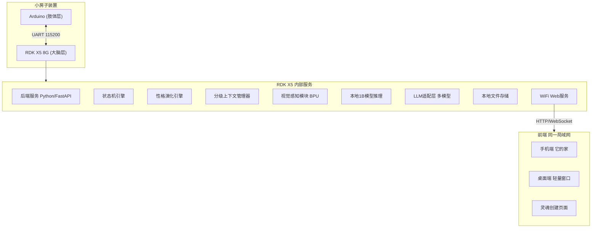
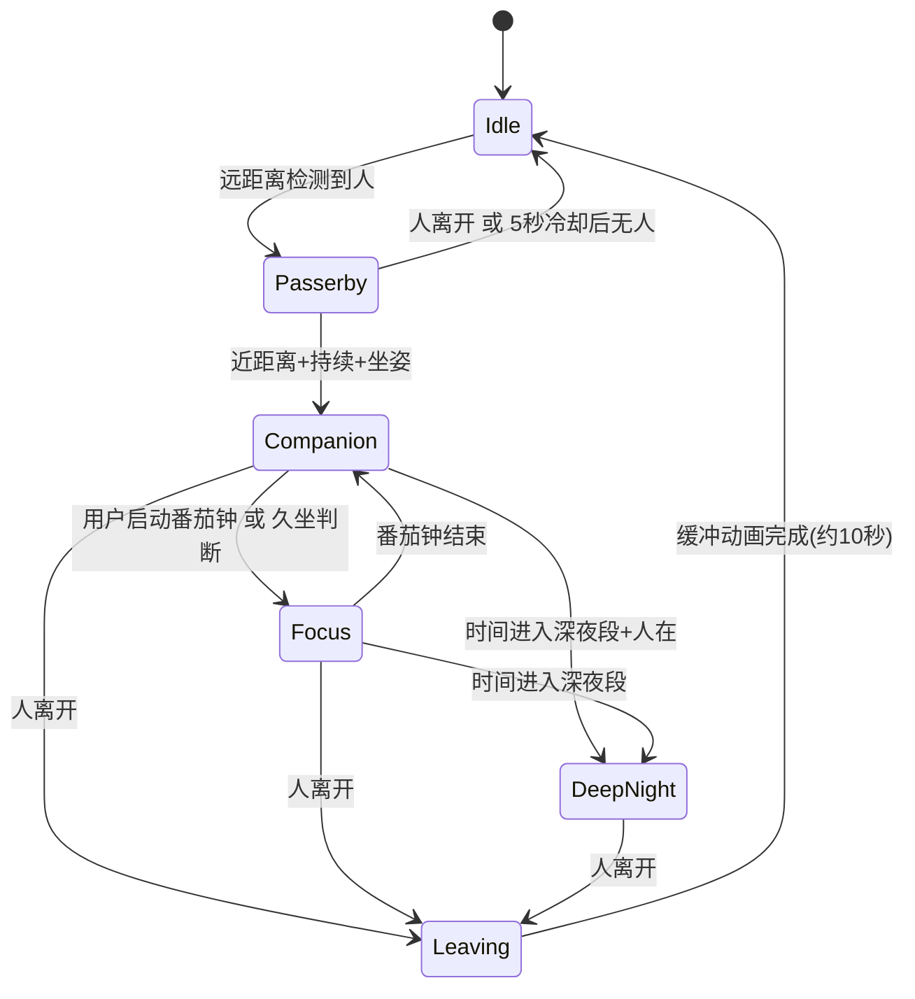
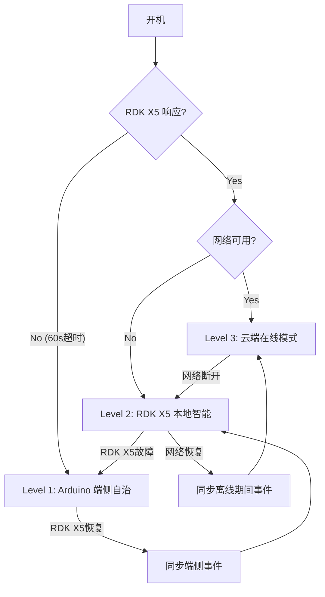

# 桌面陪伴 Agent 软件开发方案

## 1. 产品定义

一个桌面装置 + 手机 + 桌面端的陪伴系统。桌上有一个小房子，里面住着一个"存在"。有人路过它探头看一眼又缩回去，主人回来它才出来安静陪伴。

- 目标用户：独立开发者、一人公司创业者、自由职业者、远程工作者
- 核心体验：不是对话式交互，而是"安静的好朋友"式陪伴
- 交互哲学：做减法，不追你，等你回来

## 2. 系统架构总览



## 3. 项目目录结构

```
companion-agent/
├── backend/                    # RDK X5 后端服务 (Python)
│   ├── main.py                 # FastAPI 入口
│   ├── config.py               # 全局配置
│   ├── core/
│   │   ├── state_machine.py    # 状态机引擎
│   │   ├── personality.py      # 性格演化引擎
│   │   ├── context.py          # 分级上下文管理器
│   │   └── scheduler.py        # 定时任务调度
│   ├── communication/
│   │   ├── uart_manager.py     # UART 串口通信
│   │   └── protocol.py         # 通信协议定义
│   ├── intelligence/
│   │   ├── llm_adapter.py      # LLM 多模型适配层
│   │   ├── prompt_templates.py # Prompt 模板库
│   │   ├── local_model.py      # 本地1B模型推理
│   │   └── corpus.py           # 离线语料库管理
│   ├── vision/
│   │   ├── detector.py         # BPU 人体检测
│   │   └── fusion.py           # 多源感知融合
│   ├── api/
│   │   ├── routes.py           # API 路由
│   │   └── websocket.py        # WebSocket 实时推送
│   ├── storage/
│   │   └── file_store.py       # 本地文件存储管理
│   └── data/                   # 运行时数据目录
│       ├── soul.json           # L0 身份层
│       ├── personality.json    # L1 性格层
│       ├── rhythm.json         # L2 节律层
│       ├── events.jsonl        # L3 事件流日志
│       └── corpus/             # 离线语料库
│           ├── companion.json  # 陪伴态语料
│           ├── night.json      # 深夜态语料
│           └── farewell.json   # 离开态语料
│
├── firmware/                   # Arduino 固件
│   ├── firmware.ino            # 主程序
│   ├── state_machine.h/.cpp    # 端侧离线状态机
│   ├── uart_comm.h/.cpp        # UART 通信模块
│   ├── servo_ctrl.h/.cpp       # 舵机控制(缓入缓出)
│   ├── display.h/.cpp          # 屏幕显示驱动
│   ├── led_ctrl.h/.cpp         # LED 灯效控制
│   ├── sound.h/.cpp            # 喇叭/音频播放
│   ├── sensor.h/.cpp           # 距离传感器驱动
│   ├── persona_cache.h/.cpp    # 性格参数简化副本
│   ├── corpus_local.h/.cpp     # 本地预存语料
│   └── heartbeat.h/.cpp        # 心跳检测模块
│
├── frontend/                   # Web 前端
│   ├── package.json
│   ├── vite.config.ts
│   ├── src/
│   │   ├── main.ts
│   │   ├── App.vue             # (或 React)
│   │   ├── pages/
│   │   │   ├── SoulCreate.vue  # 灵魂创建 3 步
│   │   │   ├── Home.vue        # 它的家 (2D房间)
│   │   │   └── Desktop.vue     # 桌面端轻量窗口
│   │   ├── components/
│   │   │   ├── Room2D/         # 2D 房间渲染组件
│   │   │   │   ├── RoomCanvas.vue
│   │   │   │   ├── scenes/     # 离散场景定义
│   │   │   │   └── assets/     # 2D 素材
│   │   │   ├── SoulStep1.vue   # 你是谁
│   │   │   ├── SoulStep2.vue   # 你的纠结
│   │   │   ├── SoulStep3.vue   # 它的偏向
│   │   │   ├── NoteCard.vue    # 纸条组件
│   │   │   ├── StatusBar.vue   # 状态显示
│   │   │   └── WhiteNoise.vue  # 白噪音播放器
│   │   ├── services/
│   │   │   ├── api.ts          # HTTP API 调用
│   │   │   └── ws.ts           # WebSocket 连接
│   │   └── stores/
│   │       └── companion.ts    # 状态管理
│   └── public/
│       ├── sounds/             # 白噪音/环境音素材
│       └── room-assets/        # 房间2D素材
│
└── docs/
    └── architecture.md         # 本文档
```

## 4. 模块详细设计

---

### 4.1 分级上下文系统 (backend/core/context.py)

所有智能行为的数据基础。四层上下文，每层更新频率和传递策略不同。

| 层级 | 名称 | 内容 | 更新频率 | LLM传入策略 |
|------|------|------|---------|------------|
| L0 | 身份层 | 灵魂创建3步回答：自我描述、纠结、偏向选择 | 创建时写入，不变 | 每次必传 |
| L1 | 性格层 | 性格参数 JSON + 自然语言描述 | 阶段性更新(累积事件/时间间隔) | 每次必传 |
| L2 | 节律层 | 近7天作息模式：每天到达/离开时间、在座时长、深夜次数 | 每天更新 | 按需取用 |
| L3 | 实时层 | 当前状态、在座时长、时间段、最近N条事件 | 实时 | 按需取用 |

**L0 数据结构** (`data/soul.json`):
```json
{
  "created_at": "2026-04-08T10:00:00",
  "identity": "独立开发者，正在做自己的产品",
  "struggle": "要不要放弃现在的方向，换一个更容易变现的",
  "bias": "decisive",
  "opening_response": "你来了。"
}
```

**L1 数据结构** (`data/personality.json`):
```json
{
  "version": 1,
  "updated_at": "2026-04-08T23:30:00",
  "params": {
    "bias": "decisive",
    "night_owl_index": 0.0,
    "anxiety_sensitivity": 0.0,
    "quietness": 0.5,
    "attachment_level": 0.0
  },
  "natural_description": "它刚刚来到这里，还在认识你。它的性格偏果断。",
  "evolution_log": []
}
```

**L2 数据结构** (`data/rhythm.json`):
```json
{
  "updated_at": "2026-04-08",
  "days_together": 1,
  "recent_7_days": [
    {
      "date": "2026-04-08",
      "first_arrive": "09:15",
      "last_leave": "23:40",
      "total_minutes": 480,
      "late_night": true,
      "focus_sessions": 3,
      "state_switches": 12
    }
  ],
  "patterns": {
    "avg_arrive": "09:30",
    "avg_leave": "22:00",
    "late_night_ratio": 0.3,
    "regularity_score": 0.6
  }
}
```

**L3 实时数据** (内存中，不持久化完整结构):
```json
{
  "current_state": "companion",
  "state_since": "2026-04-08T14:30:00",
  "seated_minutes": 45,
  "time_period": "afternoon",
  "today_total_minutes": 300,
  "recent_events": [
    {"type": "state_change", "from": "idle", "to": "companion", "ts": 1712550000}
  ]
}
```

---

### 4.2 状态机引擎 (backend/core/state_machine.py)

6种状态，基于传感器+视觉融合数据进行判断。



各状态的硬件表现和软件行为:

**Idle (待机态)**
- 触发: 无人在桌前
- 硬件: 舵机缩回，小屏显示时钟/极简日历，灯暗
- 软件: 无 LLM 调用，仅记录时间戳

**Passerby (路人态)**
- 触发: 远距离(>100cm)检测到人，或视觉检测到站立人体
- 硬件: 舵机探出(缓入缓出，约0.8秒)，看一眼，缩回(约1.2秒)
- 软件: 5秒冷却防频繁触发，记录事件
- 判断要点: 视觉辅助 -- 只检测到人但未检测到坐姿 = 路人

**Companion (陪伴态)**
- 触发: 近距离(<80cm) + 持续>3秒 + 视觉检测到坐姿
- 硬件: 舵机探出停留，屏幕切换为安静表情/场景，环境音播放，灯效柔和
- 软件: 触发"说一句话"(首次进入时)，记录事件，开始计时
- 这是核心状态，Demo 的灵魂时刻

**Focus (专注态)**
- 触发: 用户通过前端启动番茄钟，或在座>90分钟自动判断
- 硬件: 呼吸节律灯效，白噪音/轻音乐，屏幕极简化
- 软件: 不主动打断，专注结束时"说一句话"

**DeepNight (深夜态)**
- 触发: 22:00-06:00 时间段 + 人在桌前
- 硬件: 灯光变暖变暗，它也在"熬夜"，房子里灯亮着
- 软件: 深夜专属语料/prompt，记录深夜事件(影响性格演化)

**Leaving (离开态)**
- 触发: 人离开(距离+视觉双确认)
- 硬件: 舵机缓慢缩回(1.5秒)，屏幕切回时钟，灯保留10秒后渐灭
- 软件: 记录离开事件，更新当日在座时长，检查是否触发性格更新

---

### 4.3 性格演化引擎 (backend/core/personality.py)

核心逻辑: 从用户的行为习惯中"学习"，阶段性更新性格参数，让用户能感知到变化。

**更新触发条件** (三者取先到者):
- 累积 >= 20 次状态变化事件
- 距上次更新 >= 6 小时
- 当天首次"一天结束"(用户最后一次离开后30分钟)

**参数演化规则**:
```python
def evolve(personality, recent_events, rhythm):
    # night_owl_index: 深夜在座频率
    late_nights = count_late_night_sessions(recent_events)
    personality.params.night_owl_index += late_nights * 0.05  # 缓慢增长
    
    # anxiety_sensitivity: 频繁状态切换
    switch_rate = calc_state_switch_rate(recent_events)
    if switch_rate > threshold:
        personality.params.anxiety_sensitivity += 0.03
    
    # attachment_level: 持续来访
    consecutive_days = rhythm.get_consecutive_visit_days()
    personality.params.attachment_level += consecutive_days * 0.02
    
    # quietness: 长时间专注 = 更安静
    focus_ratio = calc_focus_time_ratio(recent_events)
    personality.params.quietness += focus_ratio * 0.02
    
    # 所有参数 clamp 到 [0, 1]
    clamp_all_params(personality.params)
    
    # 用 LLM 重新生成自然语言描述
    personality.natural_description = generate_description(personality)
    
    # 同步简化副本到 Arduino
    sync_to_arduino(personality.params)
```

**用户感知渠道**:
- 房间变化: night_owl_index > 0.5 时房间出现咖啡杯，attachment_level > 0.6 时房间更整洁
- 说话方式: anxiety_sensitivity 高时说话更轻柔、更给空间
- 硬件交互: attachment_level 影响舵机探出速度和停留时长(越高越从容)

---

### 4.4 LLM 适配层 (backend/intelligence/llm_adapter.py)

支持多模型提供商切换，统一接口。

```python
class LLMAdapter:
    """多模型适配层，统一调用接口"""
    
    providers = {
        "siliconflow": SiliconFlowProvider,   # 硅基流动
        "openai": OpenAIProvider,             # OpenAI 兼容
        "local": LocalModelProvider,          # 本地1B模型
    }
    
    async def generate(self, task_type, context_levels, **kwargs):
        """
        task_type: "say_one_line" | "note" | "room_description" | "soul_init"
        context_levels: [0,1] 必传, [2] 按需
        """
        prompt = self.prompt_templates.build(task_type, context_levels)
        provider = self.select_provider()  # 在线用云端，离线用本地
        return await provider.complete(prompt, **kwargs)
    
    def select_provider(self):
        if self.network_available:
            return self.providers[self.config.preferred_cloud]
        else:
            return self.providers["local"]
```

**Prompt 模板设计** (backend/intelligence/prompt_templates.py):

两套内容体系，两种语气:

*"说一句话" prompt (陪伴态/安静好朋友语气):*
```
你是一个安静的好朋友，住在用户桌上的小房子里。
你不说教、不催促、不评价。你只是在这里。

{L0: 用户身份信息}
{L1: 你的性格描述}
{L3: 当前状态 -- 如"用户刚坐下来，下午3点，今天已经在桌前4小时了"}

请说一句话。要求:
- 不超过15个字
- 不用感叹号
- 语气像一个安静的好朋友，不是助手
- 可以是一句观察、一声轻轻的招呼、或只是表示"我在"
```

*"纸条" prompt (思考/鼓励语气):*
```
你是用户桌上小房子里的一个存在。你有自己的视角和想法。

{L0: 用户身份信息，包括他的纠结}
{L1: 你的性格偏向和描述}
{L2: 用户最近的作息节律和状态模式}

请写一张纸条。要求:
- 2-4句话
- 不是建议，不是分析报告
- 是"如果是我，我可能会这样想"的视角
- 要有温度，给人积极的力量
- 可以从用户的纠结出发，用你的性格偏向给出不同角度的思考
```

---

### 4.5 视觉感知模块 (backend/vision/)

使用 RDK X5 的 BPU 运行预训练模型，不需要额外训练。

| 能力 | 模型 | 用途 |
|------|------|------|
| 人体检测 | FCOS/YOLOv5 (Horizon预训练) | 有没有人、几个人 |
| 姿态估计 | 人体关键点检测 (预训练) | 坐着还是站着路过 |

```python
class VisionDetector:
    def detect(self, frame):
        """返回视觉感知结果"""
        persons = self.person_detector.infer(frame)
        result = VisionResult(
            person_count=len(persons),
            pose="sitting" | "standing" | "unknown",
            confidence=0.85
        )
        return result
```

**感知融合逻辑** (backend/vision/fusion.py):
```python
def fuse_judgment(distance_cm, vision_result, time_of_day, current_state):
    """融合距离传感器+视觉+时间，输出状态建议"""
    has_person = vision_result.person_count > 0
    is_sitting = vision_result.pose == "sitting"
    is_close = distance_cm < 80
    is_far = distance_cm > 150
    is_night = 22 <= time_of_day.hour or time_of_day.hour < 6
    
    if not has_person and is_far:
        return "idle"
    if has_person and not is_close and not is_sitting:
        return "passerby"
    if has_person and is_close and is_sitting:
        if is_night:
            return "deep_night"
        return "companion"
    return current_state  # 不确定时保持当前状态
```

---

### 4.6 本地1B模型 (backend/intelligence/local_model.py)

RDK X5 8G 内存跑量化小模型，作为离线推理方案。

- 推荐模型: Qwen2.5-1.5B-Instruct Q4 量化
- 推理框架: llama.cpp (ARM 编译)
- 预计占用: 约 1-1.5GB 内存
- 推理速度: 约 5-15 tokens/s
- 用途: 离线时"说一句话" + 简单纸条生成

```python
class LocalModelProvider:
    def __init__(self, model_path):
        self.llm = Llama(model_path=model_path, n_ctx=512, n_threads=4)
    
    async def complete(self, prompt, max_tokens=50):
        response = self.llm(prompt, max_tokens=max_tokens, temperature=0.7)
        return response["choices"][0]["text"]
```

---

### 4.7 UART 通信协议 (backend/communication/)

Arduino 和 RDK X5 之间通过 UART 115200 通信，JSON + 换行符分隔。

**Arduino -> RDK X5 (上报，仅状态变化时):**

```json
{"e":"state","from":"idle","to":"passerby","dist":180,"ts":1712550000}
{"e":"state","from":"passerby","to":"companion","dist":42,"dur":3,"ts":1712550003}
{"e":"hb","mode":"companion","dur":1200,"ts":1712551200}
{"e":"sensor","dist":45,"ts":1712550005}
```

**RDK X5 -> Arduino (下发指令):**

```json
{"cmd":"servo","angle":90,"curve":"ease_in_out","ms":800}
{"cmd":"servo","angle":0,"curve":"ease_in_out","ms":1200}
{"cmd":"screen","mode":"clock"}
{"cmd":"screen","mode":"face","expr":"calm"}
{"cmd":"screen","mode":"text","content":"灯留着了"}
{"cmd":"led","pattern":"breathe","color":"warm","bpm":12}
{"cmd":"sound","type":"ambient","track":"night_calm"}
{"cmd":"sync_persona","night_owl":0.72,"attach":0.45}
```

---

### 4.8 Arduino 固件 (firmware/)

Arduino 职责: 传感器采集、硬件驱动执行、离线降级状态机。

**核心逻辑:**
```
loop():
  1. 读取距离传感器
  2. 检测状态变化 -> 通过 UART 上报给 RDK X5
  3. 检查 UART 是否有 RDK X5 下发的指令 -> 执行
  4. 心跳检测: 每30秒发一次心跳，如果超过60秒没收到 RDK X5 响应 -> 切入离线模式
  5. 离线模式: 用本地状态机 + 简化性格参数 + 预存语料自主运行
```

**离线降级模式:**
- 状态机: 仅基于距离阈值判断 (无视觉)
- 说一句话: 从预存 ~50 条语料中按当前状态+时间段匹配
- 性格参数: 只读副本，不更新
- 硬件表现: 完整保留(舵机/屏幕/灯/声音)

**舵机缓入缓出:**
```cpp
// 关键细节: 不用线性运动，用缓入缓出曲线
float easeInOut(float t) {
    return t < 0.5 ? 2*t*t : -1+(4-2*t)*t;
}
// 探出慢慢加速，到位减速 -- 这个细节决定它像不像"活的"
```

---

### 4.9 Web 前端

**灵魂创建 3 步** (frontend/src/pages/SoulCreate.vue):

开场语气: "你来了。在这个小房子里，住着一个正在等你的存在。在开始之前，让它先认识你。"

- Step 1: "用一个词描述你现在的状态" -> 文本输入
- Step 2: "你最近最难做的一个决定是什么?" -> 文本/语音输入
- Step 3: "你希望它比你更___?" -> 选择: 更果断 / 更冒险 / 更慢下来

控制在 3 分钟内完成，提交后写入 `soul.json`。

**手机端"它的家"** (frontend/src/pages/Home.vue):

使用 Canvas/PixiJS 进行 2D 动态渲染。

离散场景预设 (MVP 至少 3-5 种):

| 场景ID | 条件 | 视觉表现 |
|--------|------|---------|
| clean_bright | 节奏稳定，regularity > 0.6 | 房间整洁明亮，桌上摆着东西，窗外晴朗 |
| messy_dim | 频繁切换，anxiety_sensitivity > 0.5 | 桌面凌乱，灯光偏暗 |
| late_night | 当前深夜态 | 房间灯亮着，桌上多了咖啡杯 |
| dusty | 超过3天没来 | 房间落灰，窗户起雾，它在角落发呆 |
| recovering | 从 dusty 回来后 | 房间慢慢整理，窗外天气变好 |

房间内有可交互元素:
- 角落的纸条 -> 点击查看"它的思考"
- 留言入口 -> 给它留一句话/拍照/标记情绪

**桌面端轻量窗口** (frontend/src/pages/Desktop.vue):
- 当前状态/表情
- 白噪音/环境音播放器
- 偶尔显示"它说的一句话"
- 番茄钟/专注模式启动
- 不监控屏幕，不读取窗口，不做工作上下文分析

---

### 4.10 Web API 设计 (backend/api/routes.py)

RDK X5 上的 FastAPI 服务，供前端调用:

```
POST   /api/soul/create          # 灵魂创建，写入 soul.json
GET    /api/soul                  # 获取灵魂信息

GET    /api/state                 # 获取当前状态 (状态机+实时数据)
GET    /api/personality           # 获取当前性格参数+自然描述
GET    /api/rhythm                # 获取节律数据

GET    /api/room/scene            # 获取当前房间场景ID+参数
GET    /api/notes                 # 获取纸条列表
POST   /api/notes/generate       # 触发生成一张新纸条

POST   /api/message/leave        # 用户留言 (文字/语音/照片/情绪)
POST   /api/focus/start          # 启动番茄钟
POST   /api/focus/stop           # 停止番茄钟

WS     /ws/realtime              # WebSocket: 实时状态推送
                                 # 推送: 状态变化、说一句话、性格更新通知
```

---

### 4.11 心跳与三级降级 (跨模块)



- **Level 3 (云端在线)**: 云端大模型推理 + 视觉感知 + 完整性格演化 + 可生成新房间场景
- **Level 2 (本地智能)**: RDK X5 本地1B模型 + 视觉感知 + 性格演化 + 离散房间场景
- **Level 1 (端侧自治)**: Arduino 距离规则状态机 + 预存语料匹配 + 性格只读副本 + 完整硬件表现

---

### 4.12 多端同步策略

选择性同步，不是全量:

| 数据 | 硬件端 | 手机端 | 桌面端 |
|------|--------|--------|--------|
| 当前状态 | 实时 (UART) | WebSocket 推送 | WebSocket 推送 |
| 说一句话 | UART 下发显示 | WebSocket 推送 | WebSocket 推送 |
| 性格参数 | 阶段性同步简化副本 | 按需 API 拉取 | 不同步 |
| 房间场景 | 不涉及 | 按需 API 拉取 | 不涉及 |
| 纸条 | 不涉及 | 按需 API 拉取 | 不涉及 |
| 番茄钟 | UART 灯效/音效指令 | 双向同步 | 双向同步 |
| 留言 | 不涉及 | POST API | 不涉及 |

---

## 5. MVP 优先级与任务清单

### P0 -- Demo 生死线 (ABCD)

必须跑通，跑不通就没有 Demo。

1. **灵魂创建 3 步流程** - Web 页面 + API + 写入 soul.json
2. **Arduino -> UART -> RDK X5 状态上报** - 距离传感器状态变化事件到达后端
3. **RDK X5 状态机** - 至少 idle/passerby/companion 3 种模式正确切换
4. **RDK X5 -> UART -> Arduino 指令下发** - 舵机探头/缩回 + 屏幕切换 + 灯效

### P1 -- 做了加分 (EFGI)

5. **LLM "说一句话"** - 陪伴态首次进入时触发，屏幕显示
6. **手机端"它的家"** - 至少 3 种离散房间场景 Canvas 渲染
7. **桌面端轻量窗口** - 状态显示 + 白噪音播放
8. **性格演化可感知** - Demo 时可用 mock 数据快进演示

### P2 -- Pitch 里讲

9. 纸条功能 (LLM 生成另一视角思考)
10. 视觉感知融合 (BPU 人体检测)
11. 本地1B模型离线推理
12. 心跳检测 + 三级降级
13. 房间长期养成变化
