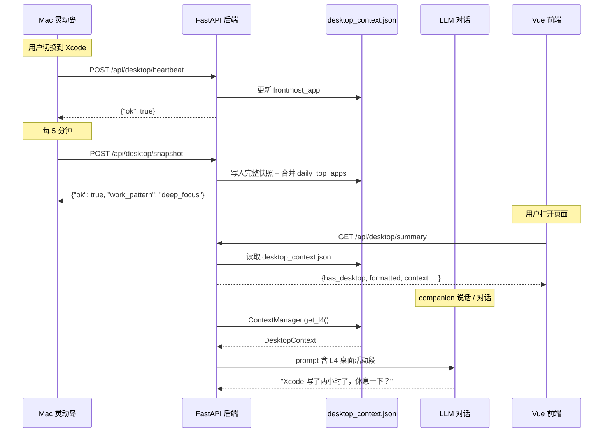
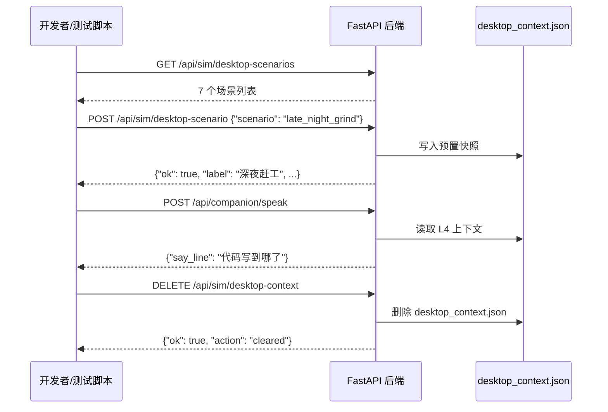

# 桌面上下文采集 — API 接口文档

> companion-agent 后端 · 版本 0.1.0 · 2026-04-09

---

## 目录

- [一、总览](#一总览)
- [二、数据模型](#二数据模型)
- [三、Mac 端上报接口](#三mac-端上报接口)
- [四、前端拉取接口](#四前端拉取接口)
- [五、Mock 模拟接口（开发/演示）](#五mock-模拟接口开发演示)
- [六、枚举值速查](#六枚举值速查)
- [七、数据流时序图](#七数据流时序图)
- [八、联调检查清单](#八联调检查清单)

---

## 一、总览

桌面上下文作为 **L4 层**注入 companion-agent 的上下文体系（L0 Soul → L1 Personality → L2 Rhythm → L3 Realtime → **L4 Desktop**），使 LLM 对话具备"用户正在做什么"的感知能力。

**Base URL**：`http://<后端IP>:8000`

| 分组 | 端点数 | 调用方 | 说明 |
|------|--------|--------|------|
| Mac 端上报 | 2 | Swift macOS App | 将桌面活动推送到后端 |
| 前端拉取 | 2 | Vue 前端 / 调试 | 读取当前桌面上下文 |
| Mock 模拟 | 4 | 开发者 / 测试脚本 | 无 Mac 时模拟桌面场景 |

所有接口均为 JSON 格式，`Content-Type: application/json`。

---

## 二、数据模型

### 2.1 AppUsageRecord

单个应用的使用记录。

| 字段 | 类型 | 默认值 | 说明 |
|------|------|--------|------|
| `app_name` | string | `""` | 应用显示名称，如 `"Xcode"` |
| `bundle_id` | string | `""` | macOS Bundle ID，如 `"com.apple.dt.Xcode"` |
| `duration_minutes` | float | `0.0` | 使用时长（分钟） |
| `category` | string | `"other"` | 应用类别，见 [枚举值：category](#61-category应用类别) |

### 2.2 DesktopSnapshot

某一时刻的桌面快照。

| 字段 | 类型 | 默认值 | 说明 |
|------|------|--------|------|
| `timestamp` | datetime | 当前时间 | 快照生成时间 |
| `frontmost_app` | string | `""` | 当前前台应用名称 |
| `frontmost_category` | string | `""` | 当前前台应用类别 |
| `window_title_hint` | string | `""` | 模糊化后的窗口标题提示（Level 2） |
| `activity_summary` | string | `""` | Vision LLM 生成的活动摘要（Level 3） |
| `hourly_usage` | AppUsageRecord[] | `[]` | 过去 1 小时各应用使用记录 |
| `app_switch_count_last_hour` | int | `0` | 过去 1 小时应用切换次数 |
| `screen_time_today_minutes` | int | `0` | 今日累计屏幕使用时间（分钟） |

### 2.3 DesktopContext

持久化在 `desktop_context.json` 中的完整桌面上下文。

| 字段 | 类型 | 默认值 | 说明 |
|------|------|--------|------|
| `updated_at` | datetime | 当前时间 | 最后更新时间 |
| `current_snapshot` | DesktopSnapshot | 空快照 | 最新的桌面快照 |
| `daily_top_apps` | AppUsageRecord[] | `[]` | 今日使用时长 Top 10 应用 |
| `avg_daily_screen_time_minutes` | int | `0` | 今日累计屏幕时间（分钟） |
| `work_pattern` | string | `""` | 推断的工作模式，见 [枚举值：work_pattern](#62-work_pattern工作模式) |

---

## 三、Mac 端上报接口

### 3.1 POST /api/desktop/heartbeat

轻量心跳。每次前台应用切换时调用，或每分钟定时调用一次。

**请求 Body**：

```json
{
  "frontmost_app": "Xcode",
  "frontmost_category": "coding",
  "bundle_id": "com.apple.dt.Xcode"
}
```

| 字段 | 类型 | 必填 | 说明 |
|------|------|------|------|
| `frontmost_app` | string | 是 | 当前前台应用名称 |
| `frontmost_category` | string | 否 | 应用类别，默认 `"other"` |
| `bundle_id` | string | 否 | macOS Bundle ID |

**响应**：

```json
{
  "ok": true
}
```

**调用时机**：
- Mac 端 `NSWorkspace.didActivateApplicationNotification` 触发时
- 或作为兜底，每 60 秒定时上报一次

---

### 3.2 POST /api/desktop/snapshot

完整快照。Mac 端每 5 分钟推送一次，包含小时级使用数据。

**请求 Body**：

```json
{
  "frontmost_app": "Xcode",
  "frontmost_category": "coding",
  "window_title_hint": "在 Xcode 中编辑 Swift 项目",
  "activity_summary": "用户在 IDE 中编写 SwiftUI 视图代码",
  "hourly_usage": [
    {
      "app_name": "Xcode",
      "bundle_id": "com.apple.dt.Xcode",
      "duration_minutes": 42.5,
      "category": "coding"
    },
    {
      "app_name": "Safari",
      "bundle_id": "com.apple.Safari",
      "duration_minutes": 8.3,
      "category": "browser"
    }
  ],
  "app_switch_count_last_hour": 7,
  "screen_time_today_minutes": 185
}
```

| 字段 | 类型 | 必填 | 说明 |
|------|------|------|------|
| `frontmost_app` | string | 否 | 当前前台应用 |
| `frontmost_category` | string | 否 | 应用类别 |
| `window_title_hint` | string | 否 | 模糊化窗口标题（Level 2 开启时） |
| `activity_summary` | string | 否 | 截屏理解摘要（Level 3 开启时） |
| `hourly_usage` | AppUsageRecord[] | 否 | 过去 1 小时各应用使用时长 |
| `app_switch_count_last_hour` | int | 否 | 过去 1 小时应用切换次数 |
| `screen_time_today_minutes` | int | 否 | 今日屏幕总时长（分钟） |

**响应**：

```json
{
  "ok": true,
  "work_pattern": "deep_focus"
}
```

| 字段 | 类型 | 说明 |
|------|------|------|
| `ok` | bool | 是否成功 |
| `work_pattern` | string | 后端推断的工作模式 |

**后端行为**：
1. 用请求数据覆盖 `current_snapshot`
2. 将 `hourly_usage` 合并累加到 `daily_top_apps`（按 `bundle_id` 去重，保留 Top 10）
3. 根据 `frontmost_category` 和 `app_switch_count_last_hour` 推断 `work_pattern`
4. 写入 `desktop_context.json`

---

## 四、前端拉取接口

### 4.1 GET /api/desktop/context

返回原始桌面上下文 JSON（与 `desktop_context.json` 内容一致）。

**请求**：无参数

**响应**：

```json
{
  "updated_at": "2026-04-09T15:30:00",
  "current_snapshot": {
    "timestamp": "2026-04-09T15:30:00",
    "frontmost_app": "Xcode",
    "frontmost_category": "coding",
    "window_title_hint": "在 Xcode 中编辑 Swift 项目",
    "activity_summary": "",
    "hourly_usage": [...],
    "app_switch_count_last_hour": 7,
    "screen_time_today_minutes": 185
  },
  "daily_top_apps": [
    {"app_name": "Xcode", "bundle_id": "com.apple.dt.Xcode", "duration_minutes": 90.0, "category": "coding"},
    {"app_name": "Safari", "bundle_id": "com.apple.Safari", "duration_minutes": 25.0, "category": "browser"}
  ],
  "avg_daily_screen_time_minutes": 115,
  "work_pattern": "deep_focus"
}
```

**用途**：需要完整结构化数据时使用（如图表、详细列表）。

---

### 4.2 GET /api/desktop/summary

聚合接口。一次请求返回结构化数据 + 可读文本摘要 + 中文工作模式标签。

**请求**：无参数

**响应**：

```json
{
  "ok": true,
  "has_desktop": true,
  "context": { ... },
  "formatted": "主人正在使用: Xcode（coding）\n窗口提示: 在 Xcode 中编辑 Swift 项目\n今日常用: Xcode(90分钟)、Safari(25分钟)\n工作模式: 深度专注中",
  "work_pattern": "deep_focus",
  "work_pattern_label_zh": "深度专注中"
}
```

| 字段 | 类型 | 说明 |
|------|------|------|
| `ok` | bool | 是否成功 |
| `has_desktop` | bool | 是否有有效桌面数据（Mac 未上报过则为 `false`） |
| `context` | DesktopContext | 完整结构化数据，同 `/context` |
| `formatted` | string | 与 LLM prompt 中 L4 段相同的可读文本，可直接展示 |
| `work_pattern` | string | 工作模式枚举值 |
| `work_pattern_label_zh` | string | 工作模式中文标签 |

**用途**：前端页面一次请求获取所有需要的数据。`formatted` 可直接用于 UI 展示，`context` 可用于细粒度渲染。

**前端调用示例**（TypeScript）：

```ts
import { getDesktopSummary } from '@/composables/useApi'

const summary = await getDesktopSummary()
if (summary.has_desktop) {
  console.log(summary.formatted)             // 可读文本
  console.log(summary.work_pattern_label_zh)  // "深度专注中"
  console.log(summary.context.current_snapshot.frontmost_app)  // "Xcode"
}
```

---

## 五、Mock 模拟接口（开发/演示）

在没有 Mac 端的情况下，通过以下接口模拟各种桌面场景。

### 5.1 GET /api/sim/desktop-scenarios

列出所有可用的预置场景。

**响应**：

```json
{
  "scenarios": [
    {"name": "deep_focus_coding", "label": "深度编码", "work_pattern": "deep_focus"},
    {"name": "distracted_browsing", "label": "分心刷网页", "work_pattern": "multitasking"},
    {"name": "in_meeting", "label": "会议中", "work_pattern": "meeting"},
    {"name": "writing_doc", "label": "写文档", "work_pattern": "general"},
    {"name": "late_night_grind", "label": "深夜赶工", "work_pattern": "deep_focus"},
    {"name": "design_review", "label": "设计评审", "work_pattern": "general"},
    {"name": "idle", "label": "离开电脑", "work_pattern": "general"}
  ]
}
```

---

### 5.2 POST /api/sim/desktop-scenario

应用一个预置场景，写入 `desktop_context.json`。

**请求 Body**：

```json
{
  "scenario": "deep_focus_coding"
}
```

| 字段 | 类型 | 必填 | 说明 |
|------|------|------|------|
| `scenario` | string | 是 | 场景名称，见 5.1 返回的 `name` |

**响应（成功）**：

```json
{
  "ok": true,
  "scenario": "deep_focus_coding",
  "label": "深度编码",
  "frontmost_app": "Xcode",
  "work_pattern": "deep_focus"
}
```

**响应（失败）**：

```json
{
  "ok": false,
  "error": "unknown scenario: xxx",
  "available": ["deep_focus_coding", "distracted_browsing", ...]
}
```

**curl 示例**：

```bash
curl -X POST http://localhost:8000/api/sim/desktop-scenario \
  -H "Content-Type: application/json" \
  -d '{"scenario": "late_night_grind"}'
```

---

### 5.3 POST /api/sim/desktop-random

随机选择一个场景（排除 `idle`）并应用。

**请求**：无 Body

**响应**：同 5.2

---

### 5.4 DELETE /api/sim/desktop-context

清除桌面上下文，模拟 Mac 端断开连接。

**请求**：无 Body

**响应**：

```json
{
  "ok": true,
  "action": "cleared"
}
```

---

## 六、枚举值速查

### 6.1 category（应用类别）

由 Mac 端 `AppCategoryClassifier` 根据 `bundle_id` 自动分类。

| 值 | 含义 | 典型应用 |
|----|------|---------|
| `coding` | 代码编辑 | Xcode, VSCode, JetBrains 系列, Cursor |
| `terminal` | 终端 | Terminal, iTerm2, Warp |
| `browser` | 浏览器 | Safari, Chrome, Firefox, Edge, Arc |
| `communication` | 通讯 | 微信, QQ, Slack, Discord, Telegram |
| `meeting` | 会议 | Zoom, 腾讯会议, Teams |
| `media` | 媒体 | Spotify, Apple Music, bilibili |
| `office` | 办公/文档 | Notion, Obsidian, Pages, Word, Notes |
| `design` | 设计 | Figma, Sketch |
| `other` | 其他 | 未匹配到的应用 |

### 6.2 work_pattern（工作模式）

由后端根据 `frontmost_category` 和 `app_switch_count_last_hour` 自动推断。

| 值 | 中文标签 | 推断规则 |
|----|---------|---------|
| `meeting` | 会议中 | 前台应用类别为 `meeting` |
| `multitasking` | 多任务并行 | 过去 1 小时切换次数 > 25 |
| `deep_focus` | 深度专注中 | 前台应用类别为 `coding` 或 `terminal` |
| `browsing` | 浏览网页中 | 前台应用类别为 `browser` |
| `general` | 一般使用 | 以上都不满足 |

推断优先级从上到下，先命中先返回。

### 6.3 隐私级别（Mac 端配置）

| 级别 | 名称 | 数据范围 | 权限要求 |
|------|------|---------|---------|
| Level 1 | 基础 | `frontmost_app` + `category` + `hourly_usage` + 切换次数 | 无需额外权限 |
| Level 2 | 增强 | Level 1 + `window_title_hint` | 辅助功能权限 |
| Level 3 | 完整 | Level 2 + `activity_summary` | 屏幕录制权限 |

---

## 七、数据流时序图

### 7.1 正常运行时序



### 7.2 Mock 开发时序



---

## 八、联调检查清单

| 步骤 | 操作 | 预期结果 |
|------|------|---------|
| 1 | Mac 浏览器访问 `http://<Win IP>:8000` | 返回 JSON `{"name": "Companion Agent Backend", ...}` |
| 2 | Mac 端启动，切换几个应用 | 后端日志出现 `POST /api/desktop/heartbeat 200` |
| 3 | 等待 5 分钟 | 后端日志出现 `POST /api/desktop/snapshot 200` |
| 4 | `curl <后端>/api/desktop/context` | `frontmost_app` 与 Mac 当前应用一致 |
| 5 | `curl <后端>/api/desktop/summary` | `has_desktop: true`，`formatted` 非空 |
| 6 | `curl -X POST <后端>/api/companion/speak` | 返回的台词体现桌面感知 |
| 7 | 无 Mac 时：`POST /api/sim/desktop-scenario` | `desktop_context.json` 写入成功 |
| 8 | `DELETE /api/sim/desktop-context` | `GET /api/desktop/summary` 返回 `has_desktop: false` |

---

*深夜施工队 · 2026-04-09*
